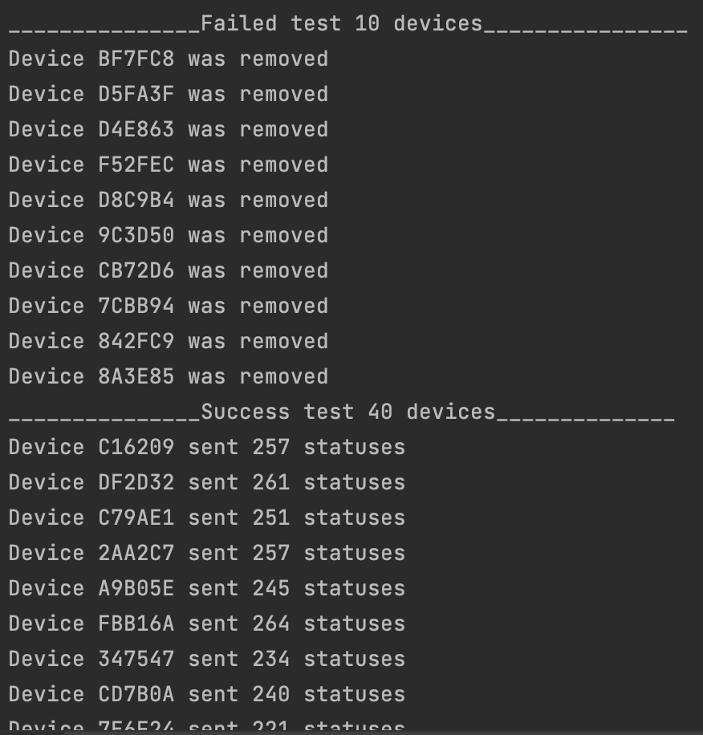
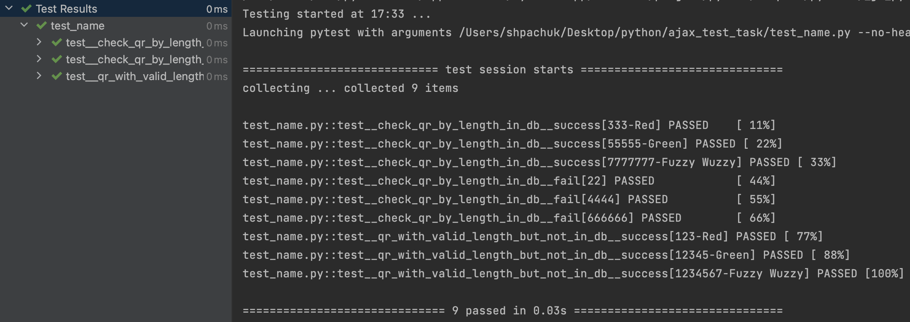

# AJAX_test_task

## Running

```shell
git clone https://github.com/anatomst/AJAX_test_task.git
python3 -m venv venv
source venv/bin/activate (on Linux and macOS) or venv\Scripts\activate (on Windows)
pip install -r requirements.txt
```

## To check first task
```shell
python3 do_it_yourself.py (on Linux and macOS)
python do_it_yourself.py (on Windows)
```
 
"Result must be like:"



## To check second task
```shell
pytest
```
 
"Result:"


